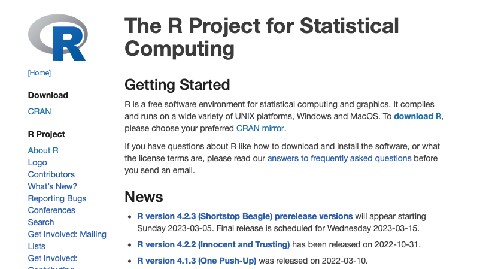
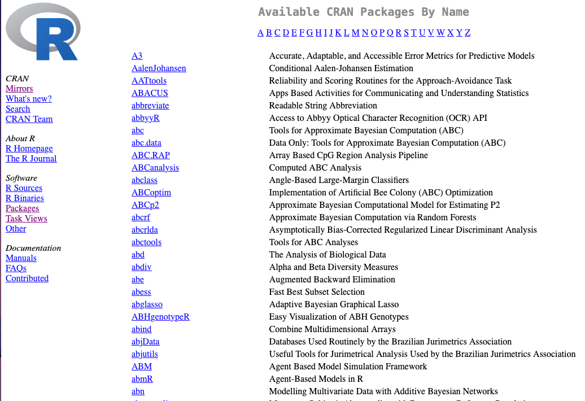
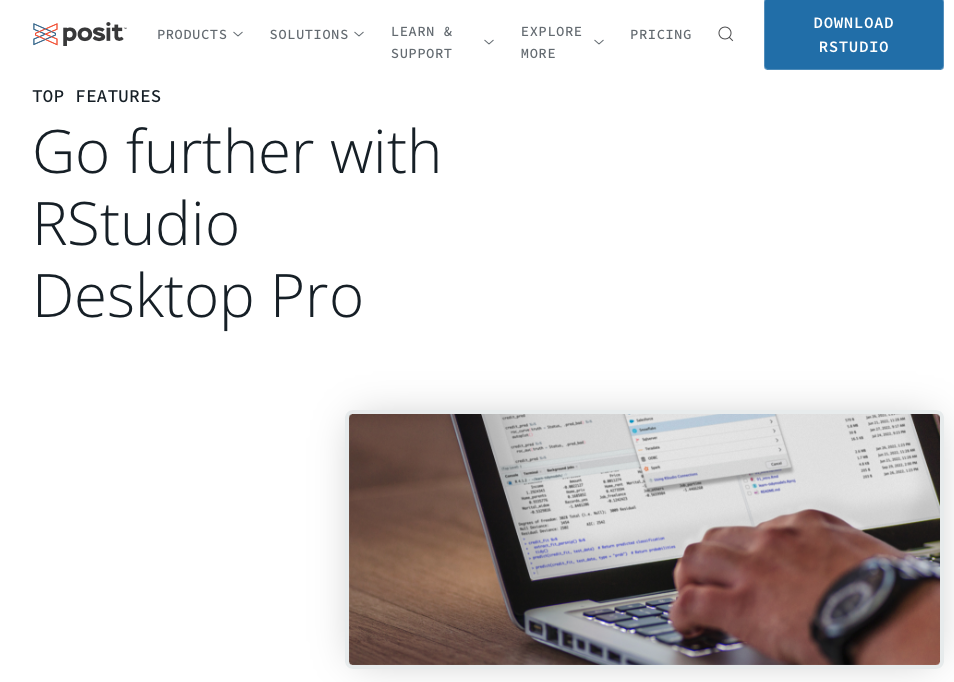
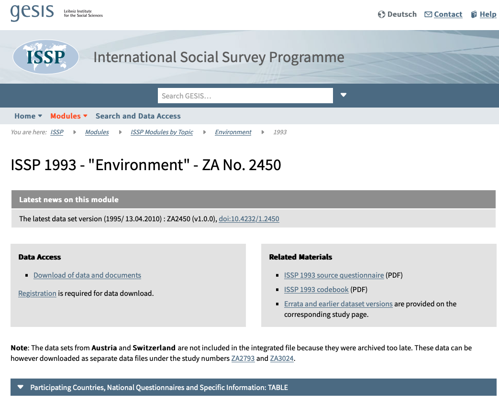
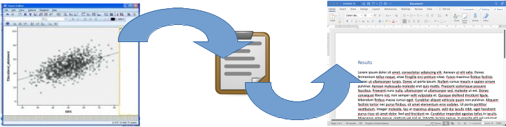

```{r setup, include=FALSE}
knitr::opts_chunk$set(echo = TRUE)
SciViews::R
```

### Introduction

**Qui suis-je ?**

{width="50%"}

-   Professeur en Faculté des Sciences, service d'Écologie numérique

-   Enseigne la science des données de la Bab2 à la Ma2 au cursus de Biologie

-   Développeur R depuis 30 ans, traducteur principal de R en français

-   Fondateur avec Kathy Huet der la plateforme d'appui en Statistique et Science des Données à l'UMONS, **STAT for U**

### STAT for U

Conseiller, former, outiller et partager autour des statistiques et science des données

Consultance pour orienter, et même depuis peu pour analyser des données (communauté UMONS et extérieur)

{width="80%"}

### Qu'est-ce que R ?

R (<https://www.r-project.org>) est un logiciel pour la **visualisation** et l'**analyse des données**.

Puissant, Open Source, disponible pour Windows, MacOS et Linux. Voir <https://youtu.be/XcBLEVknqvY>.

{width="80%"}

### Que peut-on analyser avec R ?

**Tout !** La quasi-totalité des méthodes statistiques existantes sont disponibles dans R.

Les site <https://cran.r-project.org> propose près de 20,000 packages avec des extensions pour tout faire.

{width="80%"}

### RStudio

-   RStudio permet de travailler confortablement dans R

-   Il permet d'éditer des documenrs **R Markdown** compilables en différentes formes (rapports, présentations, tableaux de bord interactifs, publications scientifiques, ouvrages ...)

{width="80%"}

## R par l'exemple

### Matériel disponible

Le matériel relatif à cette présentation est disponible ici :

\vfill

[**https://github.com/STATforU/introR1h**](https://github.com/STATforU/introR1h){.uri}

### Analyse d'un jeu de données

Grand sondage mondial concernant la [protection de l'environnement en 1993](https://www.gesis.org/en/issp/modules/issp-modules-by-topic/environment/1993). Données d'Allemagne de l'Ouest.

{width="80%"}

### Perception de la science

Quatre questions concernent la manière dont la science est perçue par les répondants en relation avec la protection de l'environnement :

\vfill

**A. Les gens croient trop souvent à la science, et pas assez aux sentiments et à la foi.**

**B. En général, la science moderne fait plus de mal que de bien.**

**C. Tout changement dans la nature apporté par les êtres humains risque d'empirer les choses.**

**D. La science moderne va résoudre nos problèmes relatifs à l'environnement sans faire de grands changements à notre mode de vie.**

\vfill

Échelle de Likert à 5 modalités : 1 = tout à fait d'accord à 5 = pas du tout d'accord

### Variables explicatives

Trois autres variables sont enregistrées :

\vfill

-   le **genre** (`sex`, 1 = homme, 2 = femme)

-   l'**âge** (`age`, 1 = 18-24, 2 = 25-34, 3 = 35-44, 4 = 45-54, 5 = 55-64, 6 = 65+)

-   le **niveau d'éducation** (`edu`, 1 = primaire, 2 = second. partim, 3 = secondaire, 4 = univ. partim, 5 = univ. cycle 1, 6 = univ. cycle 2+)

### Chargement des données et réencodage

Données au format CSV, fichier `wg93.csv` dans le sous-dossier `data`.

\vfill

```{r}
wg93 <- read.csv(here::here("data", "wg93.csv"))
knitr::kable(head(wg93))
```

### Réencodage des modalités pour 'sex'

-   sex =\> 1 = "H" et 2 = "F"

-   Utilisation d'outils d'aide dans RStudio : **QuestionR, Levels recoding**

\vfill

```{r}
# Recoding wg93$sex
wg93$sex <- wg93$sex %>%
  as.character() %>%
  fct_recode(
    "H" = "1",
    "F" = "2"
  )
```

\vfill

-   Récupération de l'instruction équivalente

### Réencodage des modalités de toutes les variables

```{r}
wg93 <- wg93 %>%
  mutate(
    A = fct_recode(as.character(A), "++" = "1", "+" = "2", "0" = "3", "-" = "4", "--" = "5"),
    B = fct_recode(as.character(B), "++" = "1", "+" = "2", "0" = "3", "-" = "4", "--" = "5"),
    C = fct_recode(as.character(C), "++" = "1", "+" = "2", "0" = "3", "-" = "4", "--" = "5"),
    D = fct_recode(as.character(D), "++" = "1", "+" = "2", "0" = "3", "-" = "4", "--" = "5"),
    sex = fct_recode(as.character(sex), "H" = "1", "F" = "2"),
    age = fct_recode(as.character(age), "18-24" = "1", "25-34" = "2", "35-44" = "3",
      "45-54" = "4", "55-64" = "5", "65+" = "6"),
    edu = fct_recode(as.character(edu), "primaire" = "1", "sec. part" = "2", "secondaire" = "3",
      "univ. part" = "4", "univ. cycle 1" = "5", "univ. cycle 2" = "6")
  )
```

### Tableau réencodé

```{r}
head(wg93, 15)
```

### Niveau d'éducation des répondants

-   Outil **Esquisse** dans RStudio.

-   Graphique en barres horizontales.

\vfill

```{r}
# Niveau d'éducation
# ... instructions à ajouter pour créer le graphique...
```

### Graphique obtenu

```{r, echo=FALSE, out.width='80%'}
ggplot(wg93) +
  aes(x = edu) +
  geom_bar(fill = "#0C4C8A") +
  labs(x = "Education level", y = "Count") +
  coord_flip() +
  theme_classic()
```

### Question B en fonction de edu

**B. En général, la science moderne fait plus de mal que de bien.**

\vfill

Tableau de contingence entre question B et edu avec `table()` :

```{r}
wg93_edu <- table(wg93$B, wg93$edu)
knitr::kable(wg93_edu)
```

### Dépendance entre question B et edu ?

Test d'indépendance du Chi^2^ avec `chisq.test()`

\vfill

```{r}
chisq.test(wg93$B, wg93$edu)
```

\vfill

*Il y a une dépendance significative au seuil* $\alpha$ *de 5% entre la réponse à la question B et le niveau d'éducation.*

### Détails question B *versus* edu

Une **analyse factorielle des correspondances** donne plus de détails (fonction `ca()` du package {ca}) :

\vfill

```{r, include=FALSE}
library(ca)
```

```{r}
library(ca)
wg93_b_edu <- ca(data = wg93, ~B + edu)
summary(wg93_b_edu, rows = FALSE, columns = FALSE)
```

### Graphique de l'AFC - question B *versus* edu

```{r}
par(bg = "white", mar = c(9, 4, 0, 2) + .1)
plot(wg93_b_edu)
```

### Dépendance entre question D et edu ?

**D. La science moderne va résoudre nos problèmes relatifs à l'environnement sans faire de grands changements à notre mode de vie.**

```{r}
chisq.test(wg93$D, wg93$edu)
```

\vfill

*Pas de dépendance significative au seuil* $\alpha$ *de 5% entre la question D et le niveau d'éducation.*

### Écriture du manuscrit

-   Choix de la revue : **Frontiers in Psychology**

{width="80%"}

### Formattage du manuscrit pour Frontiers in Pyschology

-   Template R Markdown pour ce manuscrit (cf dossier `docs/frontiers_in_psychology`)

\center

{width="50%"}

\vfill

**Analyse reproductible**

### Analyse reproductible

-   Workflow classique : on **copie-colle** depuis le logiciel de stat vers Word. **Non reproductible !**

\center

{width="80%"}

\vfill

-   Workflow R Markdown : les instructions qui génèrent les résultats (tableaux, graphiques...) sont dans le rapport directement. **Parfaitement reproductible.** -\> Science Ouverte.

### Changement d'idée

-   On (re)soumet à la revue **Psychological Science**

{width="80%"}

-   Reformattage complet nécessaire (y compris format de bibliographie)

**Pas besoin ! Il suffit juste de changer de template** (voir dossier `docs/psychological_science`).

### Ressources

-   **Contenu de la présentation :** <https://github.com/STATforU/introR1h>

-   **SaturnCloud :** <https://saturncloud.io>

-   **R :** <https://www.r-project.org>

-   **RStudio :** <https://posit.co/products/open-source/rstudio/>

-   **STAT for U :** <https://web.umons.ac.be/statforu/>
