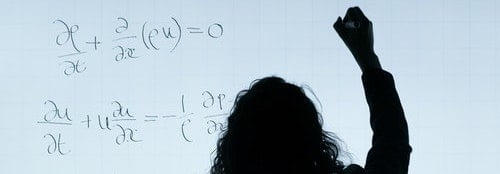

```{r setup, include=FALSE}
knitr::opts_chunk$set(echo = TRUE)
SciViews::R
```

### Introduction

Première dia...

\center

{width="60%"}

-   Item 1

-   Item 2

### Qu'est-ce que R ?

R est un logiciel pour la visualisation et l'analyse des données.

\center

{width="40%"}
